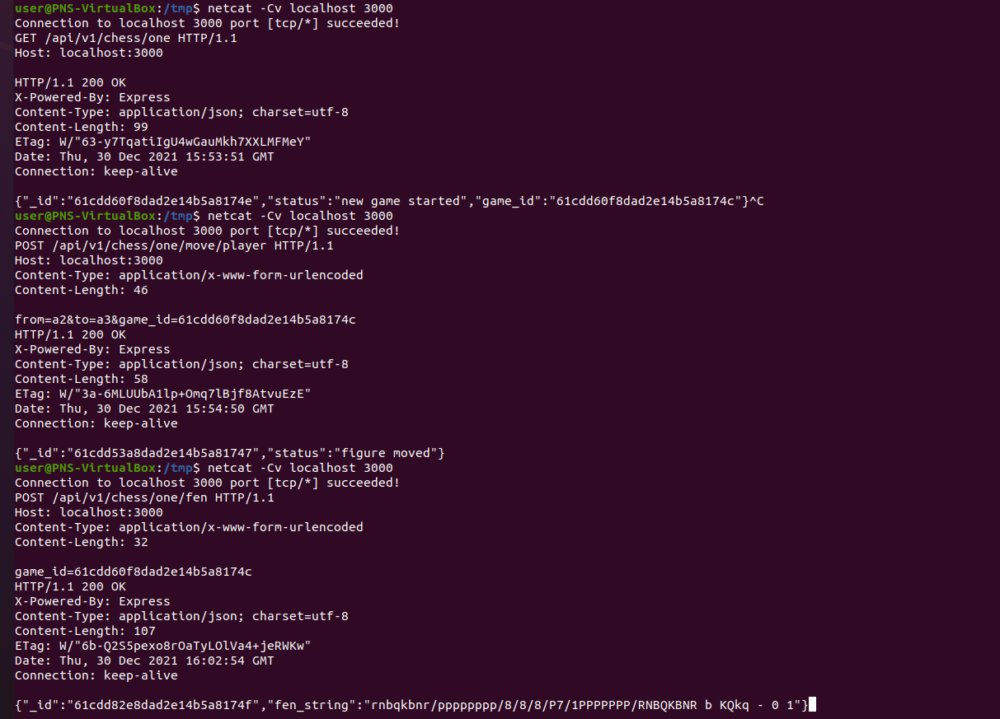

Exercice 1: APIs REST et JSON

1)
Création de cours:
```http
POST /cours HTTP/1.1
Host: www.rest-exemple.fr/
nom_cours : peinture
```

2)
Modification du nom d'un cours:
```http
PUT /123456789A/name HTTP/1.1
Host: www.rest-exemple.fr/
nom_cours : arts-plasiques
id_cours : 123456789A
```

3)
Obtention des informations du cours:
```http
GET /cours HTTP/1.1
Host: www.rest-exemple.fr/
id_cours : 123456789A
```

4)
Obtention de la liste des cours:
```http
GET /cours HTTP/1.1
Host: www.rest-exemple.fr/
```

Réponse serveur:
```http
HTTP/1.1 200 OK
Content-Type: application/json

{"cours":
    [
      {
        "id_cours": "123456789A",
        "nom_cours": "arts-plasiques",
        "nombre_participants": 0,
        "facultatif": true
      },
        {
            "id_cours": "123456789B",
            "nom_cours": "peinture",
            "nombre_participants": 100,
            "facultatif": false
        }
    ]
}
```

Exercice 2: Manipulation d'objets JSON en Java

J'ai choisi d'indenter l'affichage pour que ce soit plus lisible lorsque les JSONArray sont imbriqués.

Exercice 3: Jeu aux échecs en ligne grâce aux Services Web
Voici les commandes exécutées, leurs paramètres et les réponses:
```http
user@PNS-VirtualBox:/tmp$ netcat -Cv localhost 3000
Connection to localhost 3000 port [tcp/*] succeeded!
GET /api/v1/chess/one HTTP/1.1
Host: localhost:3000

HTTP/1.1 200 OK
X-Powered-By: Express
Content-Type: application/json; charset=utf-8
Content-Length: 99
ETag: W/"63-y7TqatiIgU4wGauMkh7XXLMFMeY"
Date: Thu, 30 Dec 2021 15:53:51 GMT
Connection: keep-alive

{"_id":"61cdd60f8dad2e14b5a8174e","status":"new game started","game_id":"61cdd60f8dad2e14b5a8174c"}^C
user@PNS-VirtualBox:/tmp$ netcat -Cv localhost 3000
Connection to localhost 3000 port [tcp/*] succeeded!
POST /api/v1/chess/one/move/player HTTP/1.1
Host: localhost:3000
Content-Type: application/x-www-form-urlencoded
Content-Length: 46

from=a2&to=a3&game_id=61cdd60f8dad2e14b5a8174c
HTTP/1.1 200 OK
X-Powered-By: Express
Content-Type: application/json; charset=utf-8
Content-Length: 58
ETag: W/"3a-6MLUUbA1lp+Omq7lBjf8AtvuEzE"
Date: Thu, 30 Dec 2021 15:54:50 GMT
Connection: keep-alive

{"_id":"61cdd53a8dad2e14b5a81747","status":"figure moved"}
user@PNS-VirtualBox:/tmp$ netcat -Cv localhost 3000
Connection to localhost 3000 port [tcp/*] succeeded!
POST /api/v1/chess/one/fen HTTP/1.1
Host: localhost:3000
Content-Type: application/x-www-form-urlencoded
Content-Length: 32

game_id=61cdd60f8dad2e14b5a8174c
HTTP/1.1 200 OK
X-Powered-By: Express
Content-Type: application/json; charset=utf-8
Content-Length: 107
ETag: W/"6b-Q2S5pexo8rOaTyLOlVa4+jeRWKw"
Date: Thu, 30 Dec 2021 16:02:54 GMT
Connection: keep-alive

{"_id":"61cdd82e8dad2e14b5a8174f","fen_string":"rnbqkbnr/pppppppp/8/8/8/P7/1PPPPPPP/RNBQKBNR b KQkq - 0 1"}

user@PNS-VirtualBox:/tmp$ netcat -Cv localhost 3000
Connection to localhost 3000 port [tcp/*] succeeded!
POST /api/v1/chess/one/move/ai HTTP/1.1
Host: localhost:3000
Content-Type: application/x-www-form-urlencoded
Content-Length: 32

game_id=61cdd60f8dad2e14b5a8174c
HTTP/1.1 200 OK
X-Powered-By: Express
Content-Type: application/json; charset=utf-8
Content-Length: 77
ETag: W/"4d-z0xOPcK1qat17J8pji7oVcW0YJg"
Date: Thu, 30 Dec 2021 16:26:07 GMT
Connection: keep-alive

{"_id":"61cddd9f8dad2e14b5a81750","status":"AI moved!","to":"e5","from":"e7"}

```
Vous pouvez consulter les captures d'écran pour plus de lisibilité:




(j'avais oublié de faire bouger l'ia et je l'ai rajoutée plus tard)
