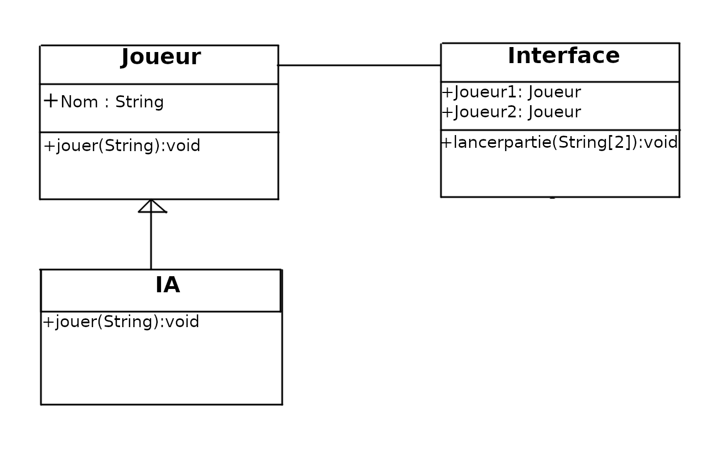

# Description Générale du Programme

Nous souhaitons programmer un client web qui communique avec un serveur internet pour jouer aux échecs. Un utilisateur humain jouera contre le programme d’IA du serveur. L’interaction avec notre programme se fera via le terminal (mode texte).

Exercice : Est-ce techniquement viable ? Quels sont les outils dont on aura besoin pour créer notre jeu d'échecs en ligne ?

> C'est techniquement viable car les échecs n'ont pas besoin d'une réponse instantanée du serveur. Par contre, si on veut jouer en étant chronometré, le terminal ne suffira pas. \
> Pour créer notre jeu d'échecs en ligne, on a juste besoin de créer un serveur et de créer un client et d'envoyer les requètes par netcat, mais un programme Java par exemple qui créerait les requètes serait plus simple d'utilisation.

# Définition des interfaces

Ensuite, pour définir les services de base de notre programme, le mieux c’est toujours de se placer dans le rôle de l’utilisateur et faire la liste des services attendus. Voici un petit guide pour le démarrage de notre projet.

Exercice : Lorsqu’un utilisateur arrive et exécute notre programme, quelles seraient ses possibles actions ou souhaits ? Comment faire pour les satisfaire ?
> Il devrait pouvoir rentrer ses coups au clavier, et avoir une représentation textuelle de la partie. Il suffit de faire un programme java pour atteindre cet objectif.

# Définition de l’architecture du programme

Nous procéderons maintenant à la modélisation de notre système. Cette étape nous permettra de bien distinguer les différentes classes et méthodes principales à coder plus tard.

Pour commencer, nous devons déterminer les différents objets (« acteurs ») qui interagiront dans notre jeu d’échec. Essayez donc de transposer un scénario réel de jeu d’échec à notre scénario virtuel.

> Un joueur joue contre une IA: tour à tour, ils doivent choisir leur coup jusqu'à la fin de la partie.

Etant donné que le tableau virtuel et les mouvements des joueurs (IA et humain) resteront « invisibles » dans le serveur distant, comment faire pour « matérialiser » le jeu sur l’ordinateur de l’utilisateur ?

> Il suffit de récupérer une représentation textuelle ou FEN et de l'afficher à l'écran.

Si nous avons déjà identifié les acteurs principaux du jeu, aucune interaction n’existe encore entre eux. Comment faire donc pour les faire travailler ensemble et atteindre notre but ?

> 

Montrer graphiquement avec un diagramme de classes les différents objets et les interactions attendues entre eux. Notez que notre programme s'appuie sur un client HTTP qui permettra de communiquer via le réseau avec le serveur de jeu d’échec.
Identifiez et ajoutez à votre dessin les méthodes principales des objets.

